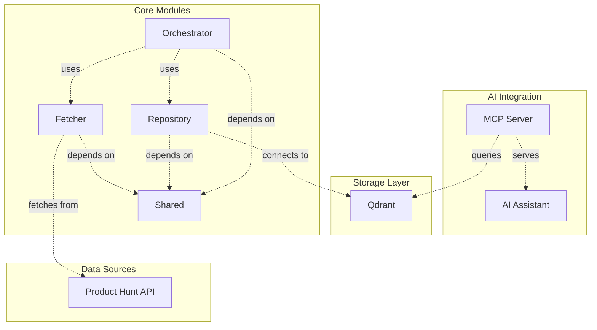

`producthunt-mcp-search` is a powerful MCP-based search platform for Product Hunt data with AI-powered natural language queries. Built with TypeScript and following modern software architecture principles, it provides a robust foundation for semantic search and data exploration through AI assistants.

## What is producthunt-mcp-search?

`producthunt-mcp-search` is a monorepo-based application that consists of several specialized modules:

- **Fetcher**: Handles data retrieval from Product Hunt
- **Repository**: Manages data persistence with Qdrant for local vector search
- **Orchestrator**: Coordinates the data ingestion workflow
- **Shared**: Contains common utilities and types used across modules

## Key Benefits

### Local-First Design
Designed for local personal use only, **enabling you to set up a powerful analysis and search platform for free on your environment** with Qdrant's efficient vector search capabilities.

### AI-Powered Search
Integrates with MCP (Model Context Protocol) to enable natural language queries through AI assistants, making data exploration accessible to everyone.

## Use Cases

`producthunt-mcp-search` is perfect for:

- **Business Opportunity Discovery**: Using AI-powered search to identify emerging trends and market needs
- **Product Research**: Gathering insights about product launches and user engagement through natural language queries
- **Competitive Intelligence**: Monitoring competitor products and their performance with semantic search
- **Market Analysis**: Understanding user pain points and willingness-to-pay signals through comment analysis

## Important Note

This tool is designed for **local personal use only**. Product Hunt's API terms of service prohibit commercial use, and this repository is provided as open source software for individual analysis and research purposes.

## Next Steps

Ready to get started? Check out our [Installation Guide](/installation/) to set up `producthunt-mcp-search` in your environment.
