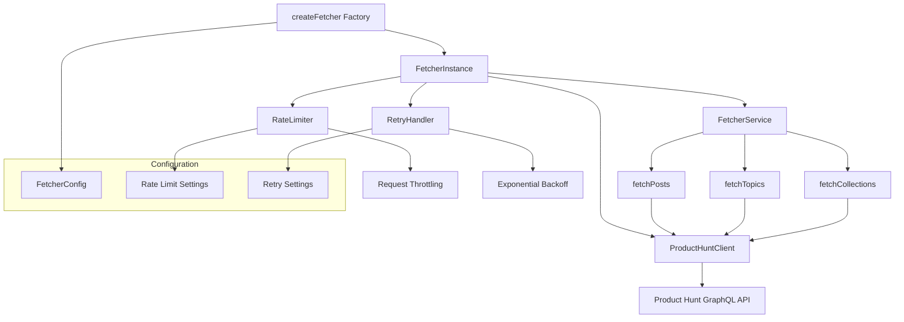

The Fetcher API provides a type-safe interface for fetching data from the Product Hunt GraphQL API with built-in rate limiting, retry mechanisms, and error handling.

## Overview

The fetcher module is organized into layers:



## Factory

### createFetcher()

Creates a fully configured fetcher instance with all necessary components.

```typescript
function createFetcher(config?: Partial<FetcherConfig>): FetcherInstance
```

**Parameters:**

- `config` (`Partial<FetcherConfig>`, optional) - Configuration overrides

**Returns:**

`FetcherInstance` - Configured fetcher with service, client, config, and logger

**Throws:**

- `ConfigError` - When configuration loading fails or API token is missing

## FetcherInstance

Interface returned by `createFetcher()`.

```typescript
interface FetcherInstance {
  service: FetcherService;
  client: ProductHuntClient;
  config: FetcherConfig;
  logger: Logger;
}
```

**Properties:**

- `service` - High-level data fetching service
- `client` - Low-level GraphQL client
- `config` - Current configuration
- `logger` - Logger instance

## FetcherService

High-level service for data fetching operations.

### fetchPosts()

Fetches posts from Product Hunt with pagination support.

```typescript
async fetchPosts(options?: FetchOptions): AsyncResult<FetchResult<PostNode>, Error>
```

**Parameters:**

- `options.maxItems` (`number`, optional) - Maximum posts to fetch (default: 100)
- `options.batchSize` (`number`, optional) - Posts per request (default: 10)
- `options.startCursor` (`string`, optional) - Pagination cursor
- `options.unlimited` (`boolean`, optional) - Fetch all posts (ignores maxItems)

**Returns:**

`AsyncResult<FetchResult<PostNode>, Error>` - Result with posts and pagination info

**FetchResult Properties:**

```typescript
interface FetchResult<T> {
  data: T[];
  hasMore: boolean;
  nextCursor?: string;
  totalFetched: number;
}
```

---

### fetchTopics()

Fetches topics from Product Hunt with pagination support.

```typescript
async fetchTopics(options?: FetchOptions): AsyncResult<FetchResult<TopicNode>, Error>
```

**Parameters:**

- `options.maxItems` (`number`, optional) - Maximum topics to fetch (default: 10000)
- `options.batchSize` (`number`, optional) - Topics per request (default: 10)
- `options.startCursor` (`string`, optional) - Pagination cursor
- `options.unlimited` (`boolean`, optional) - Fetch all topics (ignores maxItems)

**Returns:**

`AsyncResult<FetchResult<TopicNode>, Error>` - Result with topics and pagination info

---

### fetchCollections()

Fetches collections from Product Hunt with pagination support.

```typescript
async fetchCollections(options?: FetchOptions): AsyncResult<FetchResult<CollectionNode>, Error>
```

**Parameters:**

- `options.maxItems` (`number`, optional) - Maximum collections to fetch (default: 10000)
- `options.batchSize` (`number`, optional) - Collections per request (default: 10)
- `options.startCursor` (`string`, optional) - Pagination cursor
- `options.unlimited` (`boolean`, optional) - Fetch all collections (ignores maxItems)

**Returns:**

`AsyncResult<FetchResult<CollectionNode>, Error>` - Result with collections and pagination info

## Configuration

### FetcherConfig

Complete configuration interface.

```typescript
interface FetcherConfig {
  productHunt: {
    apiToken: string;
    endpoint: string;
    userAgent?: string;
  };
  rateLimit: {
    requestsPerSecond: number;
    burstLimit: number;
  };
  retry: {
    maxRetries: number;
    initialDelay: number;
    maxDelay: number;
    backoffMultiplier: number;
  };
  logLevel: 'debug' | 'info' | 'warn' | 'error';
}
```

**Default Values:**

```typescript
{
  productHunt: {
    endpoint: 'https://api.producthunt.com/v2/api/graphql',
    userAgent: 'producthunt-mcp-research/1.0.0'
  },
  rateLimit: {
    requestsPerSecond: 0.056,  // 50 requests per 15 minutes
    burstLimit: 3               // Allow bursts of 3
  },
  retry: {
    maxRetries: 5,
    initialDelay: 5000,        // 5 seconds
    maxDelay: 60000,           // 60 seconds
    backoffMultiplier: 2
  },
  logLevel: 'info'
}
```

## Low-Level Client

For advanced use cases, you can use the low-level client directly.

### ProductHuntClient

```typescript
class ProductHuntClient {
  posts: PostsClient;
  topics: TopicsClient;
  collections: CollectionsClient;
}
```

## Error Types

The fetcher uses several error types for different failure scenarios:

### ConfigError

Thrown when configuration is invalid or missing.

```typescript
import { ConfigError } from '@producthunt-mcp-research/fetcher';

try {
  const fetcher = createFetcher();
} catch (error) {
  if (error instanceof ConfigError) {
    console.error('Config error:', error.message);
  }
}
```

### RateLimitError

Thrown when API rate limits are exceeded.

```typescript
import { RateLimitError } from '@producthunt-mcp-research/fetcher';

// RateLimitError includes retryAfter information
if (error instanceof RateLimitError) {
  console.log(`Rate limited. Retry after ${error.retryAfter} seconds`);
}
```

### NetworkError

Thrown for network-related failures.

```typescript
import { NetworkError } from '@producthunt-mcp-research/fetcher';

if (error instanceof NetworkError) {
  console.error('Network error:', error.message);
}
```

### ApiError

Thrown for API-related errors with status codes.

```typescript
import { ApiError } from '@producthunt-mcp-research/fetcher';

if (error instanceof ApiError) {
  console.error(`API error ${error.statusCode}:`, error.message);
}
```

### RetryError

Thrown when all retry attempts are exhausted.

```typescript
import { RetryError } from '@producthunt-mcp-research/fetcher';

if (error instanceof RetryError) {
  console.error('All retry attempts failed:', error.message);
}
```

## Related

- [Orchestrator API](/reference/orchestrator/) - High-level sync operations
- [CLI Reference](/reference/cli/) - Command-line interface
