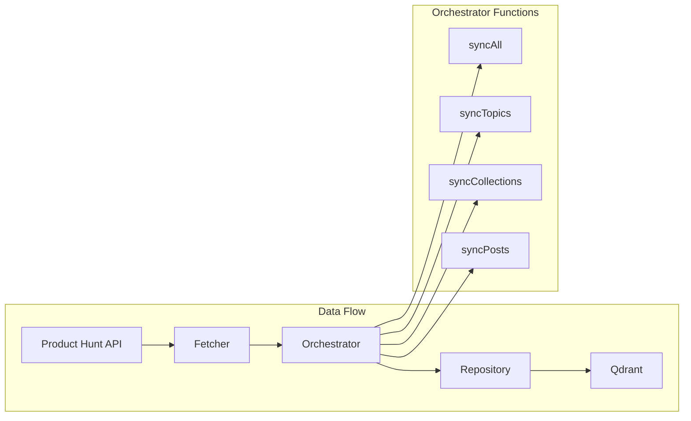

The Orchestrator API provides functions for coordinating data synchronization between the Product Hunt API (via Fetcher) and your local Qdrant instance (via Repository).

## Overview

The orchestrator layer sits between the fetcher and repository layers, managing the data flow:



All orchestrator functions follow a consistent pattern:
- Accept a fetcher instance, repository, options, and logger
- Return an `AsyncResult<SyncStats, Error>`
- Handle errors gracefully with detailed logging

## Functions

### syncAll()

Synchronizes all data types (topics, collections, posts with comments) in a balanced manner with automatic resumption.

```typescript
async function syncAll(
  fetcher: FetcherInstance,
  repository: OrchestratorRepository,
  options?: SyncOptions,
  logger: Logger
): AsyncResult<SyncStats, Error>
```

**Parameters:**

- `fetcher` (`FetcherInstance`) - Fetcher instance for API operations
- `repository` (`OrchestratorRepository`) - Repository wrapper with database client
- `options` (`SyncOptions`, optional) - Synchronization options
- `logger` (`Logger`) - Logger instance for operation tracking

**Returns:**

`AsyncResult<SyncStats, Error>` - Result containing aggregated statistics or error

**Automatic Resumption:**

All sync functions (`syncAll`, `syncPosts`, `syncTopics`, `syncCollections`) automatically resume from where they left off using saved cursors. If interrupted, simply run the function again to continue from the last successful position. The `nextCursor` field in the returned statistics can be used to manually resume from a specific point.

---

### syncPosts()

Synchronizes Product Hunt posts (including comments).

```typescript
async function syncPosts(
  fetcher: FetcherInstance,
  repository: OrchestratorRepository,
  options?: SyncOptions,
  logger: Logger
): AsyncResult<SyncStats, Error>
```

**Parameters:**

- `fetcher` (`FetcherInstance`) - Fetcher instance
- `repository` (`OrchestratorRepository`) - Repository wrapper
- `options` (`SyncOptions`, optional) - Sync options
- `logger` (`Logger`) - Logger instance

**Returns:**

`AsyncResult<SyncStats, Error>` - Result with sync statistics

**Automatic Resumption:**

Automatically resumes from the last saved cursor position. The `nextCursor` field in the returned statistics indicates the position for the next sync operation.

---

### syncTopics()

Synchronizes all Product Hunt topics.

```typescript
async function syncTopics(
  fetcher: FetcherInstance,
  repository: OrchestratorRepository,
  options?: SyncOptions,
  logger: Logger
): AsyncResult<SyncStats, Error>
```

**Parameters:**

- `fetcher` (`FetcherInstance`) - Fetcher instance
- `repository` (`OrchestratorRepository`) - Repository wrapper
- `options` (`SyncOptions`, optional) - Sync options
- `logger` (`Logger`) - Logger instance

**Returns:**

`AsyncResult<SyncStats, Error>` - Result with sync statistics

**Automatic Resumption:**

Automatically resumes from the last saved cursor position. The `nextCursor` field in the returned statistics indicates the position for the next sync operation.

---

### syncCollections()

Synchronizes all Product Hunt collections.

```typescript
async function syncCollections(
  fetcher: FetcherInstance,
  repository: OrchestratorRepository,
  options?: SyncOptions,
  logger: Logger
): AsyncResult<SyncStats, Error>
```

**Parameters:**

- `fetcher` (`FetcherInstance`) - Fetcher instance
- `repository` (`OrchestratorRepository`) - Repository wrapper
- `options` (`SyncOptions`, optional) - Sync options
- `logger` (`Logger`) - Logger instance

**Returns:**

`AsyncResult<SyncStats, Error>` - Result with sync statistics

**Automatic Resumption:**

Automatically resumes from the last saved cursor position. The `nextCursor` field in the returned statistics indicates the position for the next sync operation.

## Types

### OrchestratorRepository

Wrapper interface for repository layer components.

```typescript
interface OrchestratorRepository {
  client: DatabaseClient;
  repository: Repository;
}
```

**Properties:**

- `client` - DatabaseClient instance for connection management
- `repository` - Unified Repository instance for all entity types

---

### SyncOptions

Options for controlling synchronization behavior.

```typescript
interface SyncOptions {
  batchSize?: number;
  maxItems?: number;
  onProgress?: (progress: number, message: string) => void;
}
```

**Properties:**

- `batchSize` (optional) - Number of items per API request (default: 10)
- `maxItems` (optional) - Maximum items to fetch (default: 100)
- `onProgress` (optional) - Callback for progress updates

---

### SyncStats

Statistics returned from synchronization operations.

```typescript
interface SyncStats {
  totalFetched: number;
  totalSaved: number;
  errors: number;
  startTime: Date;
  endTime?: Date;
  duration?: number;
  nextCursor?: string;
  postsProcessed?: number;
  usersProcessed?: number;
}
```

**Properties:**

- `totalFetched` - Total items fetched from API
- `totalSaved` - Total items saved to database
- `errors` - Number of errors encountered
- `startTime` - Sync start timestamp
- `endTime` - Sync end timestamp (when completed)
- `duration` - Total duration in milliseconds
- `nextCursor` - Cursor for resuming sync (optional)
- `postsProcessed` - Number of posts processed (for post sync, optional)
- `usersProcessed` - Number of unique users processed (for post sync, optional)

---

## Related

- [CLI Reference](/reference/cli/) - Command-line interface for sync operations
- [Fetcher API](/reference/fetcher/) - Data fetching from Product Hunt API
- [Repository API](/reference/repository/) - Data persistence to Qdrant
