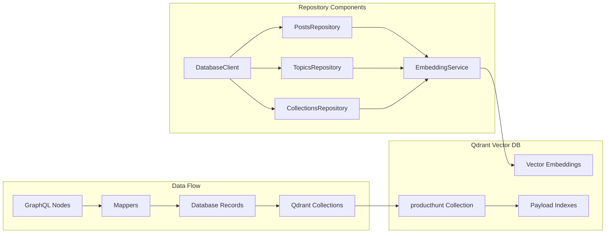
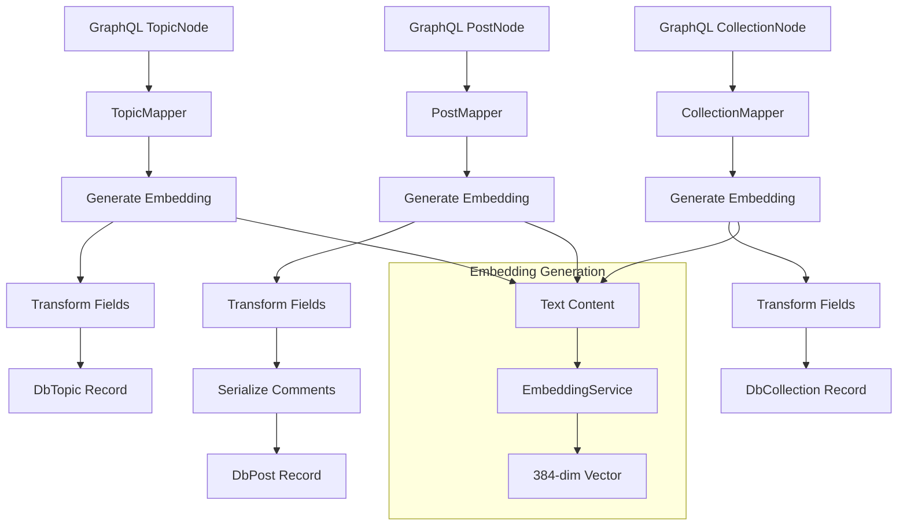
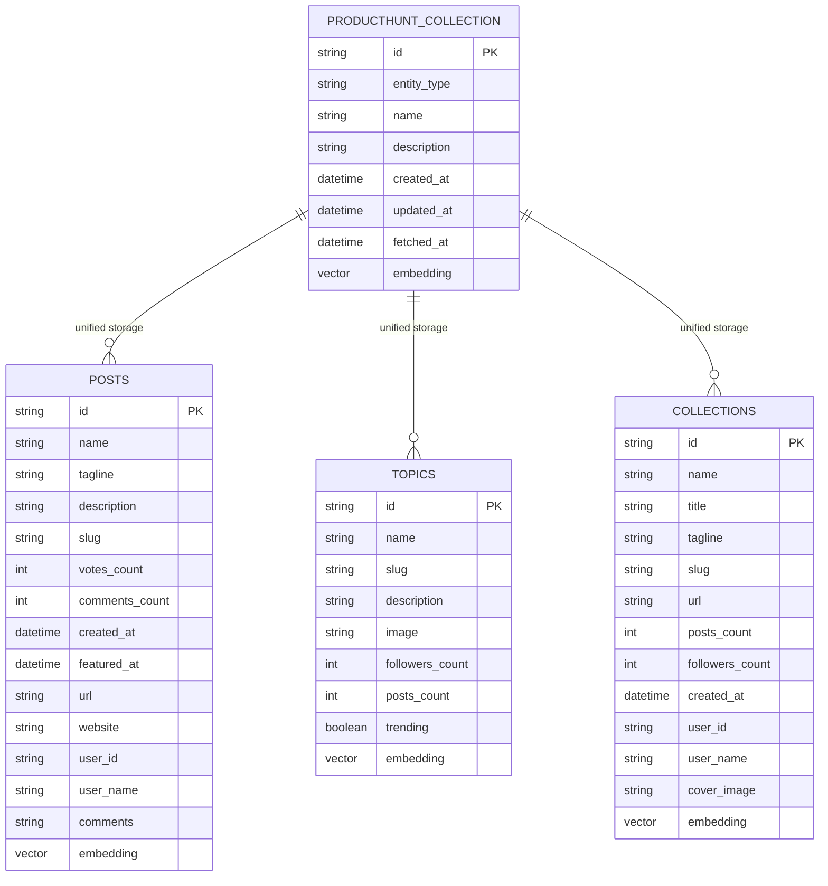
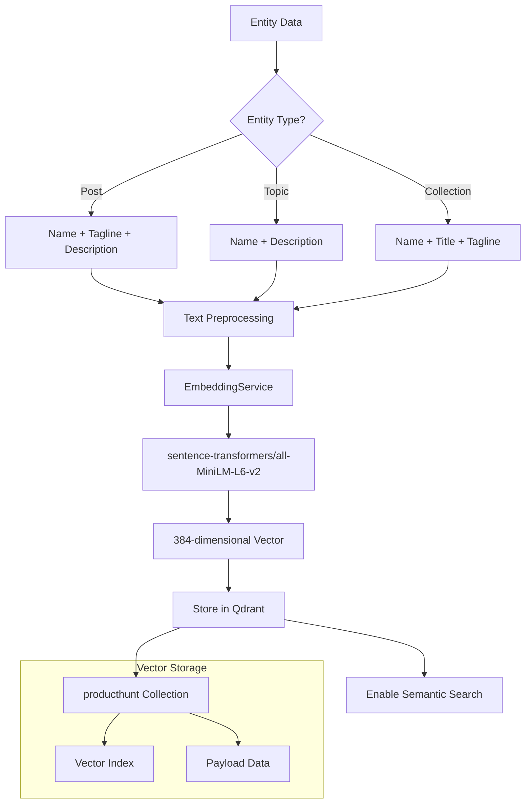

The Repository API provides a data persistence layer for storing Product Hunt data in Qdrant with automatic vector embedding generation.

## Overview

The repository layer handles:

- **Database Connection**: Managing Qdrant connections
- **Data Persistence**: Saving posts, topics, and collections
- **Schema Management**: Collection creation and management
- **Data Mapping**: Converting GraphQL nodes to database records

**Architecture:**



## DatabaseClient

Manages Qdrant connection and provides low-level database operations.

### Constructor

```typescript
new DatabaseClient(config: DatabaseConfig, logger: Logger)
```

**Parameters:**

- `config` - Database configuration
- `logger` - Logger instance

---

### connect()

Establishes connection to Qdrant.

```typescript
async connect(): AsyncResult<void, Error>
```

**Returns:**

`AsyncResult<void, Error>` - Success or error

---

### disconnect()

Closes the database connection.

```typescript
async disconnect(): AsyncResult<void, Error>
```

---

### tableExists()

Checks if a table exists in the database.

```typescript
async tableExists(tableName: string): AsyncResult<boolean, Error>
```

**Parameters:**

- `tableName` - Name of the table to check

---

### batchUpsert()

Inserts or updates multiple records in a single operation.

```typescript
async batchUpsert<T extends DatabaseRecord>(
  tableName: string,
  records: T[]
): AsyncResult<BatchResult, Error>
```

**Parameters:**

- `tableName` - Target table name
- `records` - Array of database records

**Returns:**

`BatchResult` with counts:

```typescript
interface BatchResult {
  inserted: number;
  updated: number;
  failed: number;
}
```

## Repository

### Repository

Manages all Product Hunt entities in a unified collection.

#### Constructor

```typescript
new Repository(
  client: DatabaseClient,
  logger: Logger,
  config: DatabaseConfig,
  embeddingService: EmbeddingService
)
```

**Parameters:**

- `client` - Database client instance
- `logger` - Logger instance
- `config` - Database configuration
- `embeddingService` - Embedding generation service

---

#### savePosts()

Saves multiple posts to the unified collection.

```typescript
async savePosts(
  posts: DbPost[]
): AsyncResult<{ total: number; inserted: number; errors: number }, Error>
```

**Parameters:**

- `posts` - Array of DbPost records

**Returns:**

Result with save statistics:
- `total` - Total posts processed
- `inserted` - Successfully inserted posts
- `errors` - Failed operations

**Features:**

- Automatically generates vector embeddings
- Stores in unified collection
- Handles batch operations
- Provides detailed statistics

---

#### saveTopics()

Saves multiple topics to the unified collection.

```typescript
async saveTopics(
  topics: DbTopic[]
): AsyncResult<{ total: number; inserted: number; errors: number }, Error>
```

**Parameters:**

- `topics` - Array of DbTopic records

**Returns:**

Result with save statistics:
- `total` - Total posts processed
- `inserted` - Successfully inserted posts
- `errors` - Failed operations

**Features:**

- Generates embeddings for topic content
- Unified storage format
- Batch processing

---

#### saveCollections()

Saves multiple collections to the unified collection.

```typescript
async saveCollections(
  collections: DbCollection[]
): AsyncResult<{ total: number; inserted: number; errors: number }, Error>
```

**Parameters:**

- `collections` - Array of DbCollection records

**Returns:**

Result with save statistics:
- `total` - Total posts processed
- `inserted` - Successfully inserted posts
- `errors` - Failed operations

**Features:**

- Generates embeddings for collection content
- Unified storage format
- Batch processing

## Configuration

### loadDatabaseConfig()

Loads database configuration from environment variables.

```typescript
function loadDatabaseConfig(): DatabaseConfig
```

**Returns:**

```typescript
interface DatabaseConfig {
  uri: string;
  batchSize: number;
  vectorDimensions: number;
  logLevel: 'debug' | 'info' | 'warn' | 'error';
}
```

**Environment Variables:**

- `EMBEDDING_MODEL` - Embedding model (default: `Xenova/all-MiniLM-L6-v2`)

---

## Data Mappers

Mappers convert GraphQL nodes to database records.

**Mapping Process:**



### Mapper

```typescript
class Mapper {
  // GraphQL to Database mapping
  fromPostNode(node: PostNode): DbPost;
  fromTopicNode(node: TopicNode): DbTopic;
  fromCollectionNode(node: CollectionNode): DbCollection;
  
  // Multiple entity mapping
  fromPostNodes(nodes: PostNode[]): DbPost[];
  fromTopicNodes(nodes: TopicNode[]): DbTopic[];
  fromCollectionNodes(nodes: CollectionNode[]): DbCollection[];
  
  // Database to Unified mapping
  fromPost(post: DbPost): UnifiedPost;
  fromTopic(topic: DbTopic): UnifiedTopic;
  fromCollection(collection: DbCollection): UnifiedCollection;
  
  // Multiple unified mapping
  fromPosts(posts: DbPost[]): UnifiedPost[];
  fromTopics(topics: DbTopic[]): UnifiedTopic[];
  fromCollections(collections: DbCollection[]): UnifiedCollection[];
}
```

**Mapping Process:**

- **GraphQL to Database**: Converts GraphQL nodes to database records
- **Database to Unified**: Converts database records to unified collection format
- **Batch Operations**: Handles multiple entities efficiently
- **Field Transformation**: Converts camelCase to snake_case, handles nested data

## Database Schema

**Schema Overview:**



### Posts Table

```typescript
interface DbPost {
  id: string;                    // Primary key
  name: string;
  tagline: string;
  description?: string;
  slug: string;
  votes_count: number;
  comments_count: number;
  created_at: string;
  featured_at?: string;
  url: string;
  website?: string;
  user_id?: string;
  user_name?: string;
  comments?: string;             // JSON array
  vector?: number[];             // Embedding vector (384 dimensions)
}
```

**Comments Structure:**

Comments are stored as a JSON string containing the full comment tree:

```json
[
  {
    "id": "comment-1",
    "body": "Great product!",
    "createdAt": "2024-01-15T10:00:00Z",
    "votesCount": 5,
    "user": {
      "id": "user-1",
      "name": "John Doe"
    }
  }
]
```

---

### Topics Table

```typescript
interface DbTopic {
  id: string;
  name: string;
  slug: string;
  description?: string;
  image?: string;
  followers_count?: number;
  posts_count?: number;
  trending?: boolean;
  vector?: number[];
}
```

---

### Collections Table

```typescript
interface DbCollection {
  id: string;
  name: string;
  title: string;
  tagline?: string;
  slug: string;
  url: string;
  posts_count?: number;
  followers_count?: number;
  created_at: string;
  user_id?: string;
  user_name?: string;
  cover_image?: string;
  vector?: number[];
}
```

## Vector Embeddings

All repositories automatically generate vector embeddings for semantic search.

**Embedding Generation Process:**



**Embedding Details:**

- **Posts**: Name + tagline + description
- **Topics**: Name + description
- **Collections**: Name + title + tagline

**Vector Dimensions:** 384 (default, configurable)

**Model:** Uses embeddings compatible with Qdrant MCP server (sentence-transformers/all-MiniLM-L6-v2)

## Error Handling

All repository methods return `AsyncResult<T, Error>`:

```typescript
const result = await repository.savePosts(posts);

if (result.success) {
  console.log(`Saved ${result.data.inserted} posts`);
  console.log(`Total processed: ${result.data.total}`);
  console.log(`Errors: ${result.data.errors}`);
} else {
  console.error('Save failed:', result.error.message);
  
  // Handle specific errors
  if (result.error.message.includes('connection')) {
    console.log('Database connection issue');
  }
}
```

## Related

- [Orchestrator API](/reference/orchestrator/) - High-level sync operations
- [Fetcher API](/reference/fetcher/) - Data fetching from Product Hunt
- [Quick Start](/quick-start/) - Getting started guide
